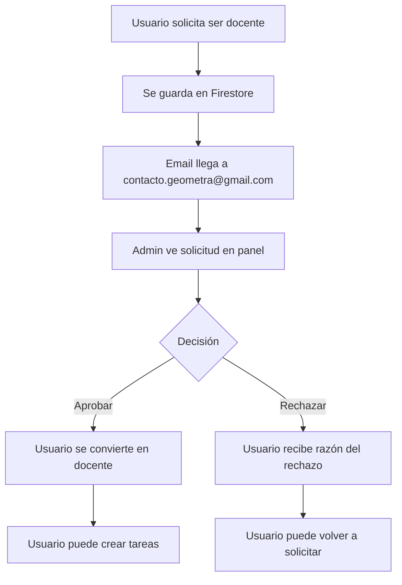

# Panel de Administración de Solicitudes de Docentes

## ✅ Implementación Completa

Se ha creado el panel de administración para gestionar las solicitudes de usuarios que quieren convertirse en docentes.

---

## 🎯 Cómo Hacerte Administrador

### Opción 1: Botón Temporal (MÁS FÁCIL)

1. Ve a la página principal: http://localhost:9002
2. Verás un botón morado en la esquina inferior derecha: **"🔑 Hacerme Admin"**
3. Haz clic en el botón
4. Recarga la página
5. ¡Listo! Ahora eres admin

### Opción 2: Consola del Navegador

1. Abre la aplicación en el navegador
2. Presiona **F12** para abrir las herramientas de desarrollador
3. Ve a la pestaña **Console**
4. Copia y pega este código:

```javascript
import { doc, updateDoc, serverTimestamp } from 'firebase/firestore';
import { db } from '@/firebase/config';
import { getAuth } from 'firebase/auth';

const auth = getAuth();
const user = auth.currentUser;
const userRef = doc(db, 'users', user.uid, 'profile', 'data');
await updateDoc(userRef, { role: 'admin', updatedAt: serverTimestamp() });
console.log('✅ Ahora eres admin!');
location.reload();
```

5. Presiona Enter
6. Recarga la página

---

## 📋 Acceder al Panel de Admin

Una vez que seas admin, accede a:

**http://localhost:9002/admin/teacher-requests**

---

## 🎨 Funcionalidades del Panel

### Filtros
- **Todas**: Ver todas las solicitudes
- **Pendientes**: Solo solicitudes sin revisar
- **Aprobadas**: Solicitudes aceptadas
- **Rechazadas**: Solicitudes rechazadas

### Acciones Disponibles

#### Para Solicitudes Pendientes:
1. **Aprobar** ✅
   - Convierte al usuario en docente
   - Actualiza su rol en Firestore
   - El usuario puede crear tareas y dar feedback

2. **Rechazar** ❌
   - Abre un modal para escribir la razón del rechazo
   - El usuario verá la razón en su perfil
   - Puede volver a solicitar después

### Información Mostrada
- Nombre del solicitante
- Email
- Fecha de solicitud
- Razón por la que quiere ser docente
- Estado actual (pendiente/aprobado/rechazado)
- Razón del rechazo (si aplica)

---

## 🔄 Flujo Completo



---

## 📁 Archivos Creados

| Archivo | Descripción |
|---------|-------------|
| [page.tsx](file:///home/vickoto/Documentos/geometra/src/app/admin/teacher-requests/page.tsx) | Panel de administración |
| [MakeAdminButton.tsx](file:///home/vickoto/Documentos/geometra/src/components/admin/MakeAdminButton.tsx) | Botón temporal para hacerse admin |

---

## 🗑️ Limpiar Después

Una vez que te hayas hecho admin, puedes eliminar el botón temporal:

1. Abre [page.tsx](file:///home/vickoto/Documentos/geometra/src/app/page.tsx)
2. Elimina la línea: `import MakeAdminButton from '@/components/admin/MakeAdminButton';`
3. Elimina la línea: `<MakeAdminButton />`

O simplemente déjalo, solo aparece en la página principal y es útil por si necesitas hacer admin a otro usuario.

---

## 🎯 Próximos Pasos

1. **Hazte admin** usando el botón morado
2. **Accede al panel**: http://localhost:9002/admin/teacher-requests
3. **Aprueba tu propia solicitud** (si hiciste una)
4. **Verifica que ahora eres docente** en tu perfil

---

## ✨ Características Adicionales

- **Protección de ruta**: Solo usuarios admin pueden acceder
- **Redirección automática**: Si no eres admin, te redirige a home
- **UI moderna**: Diseño limpio y profesional
- **Filtros en tiempo real**: Cambia entre estados sin recargar
- **Modal de rechazo**: Interfaz clara para rechazar solicitudes
- **Feedback visual**: Badges de colores según el estado
